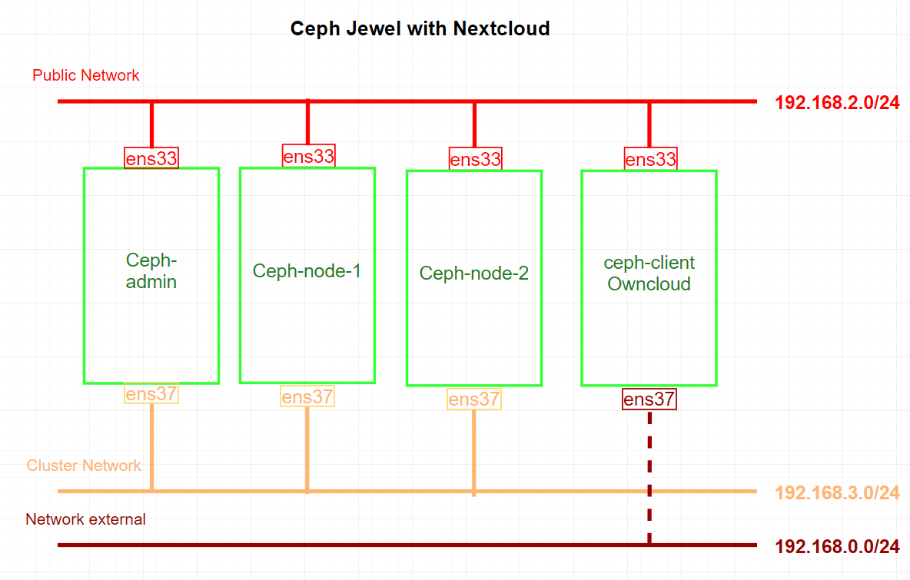
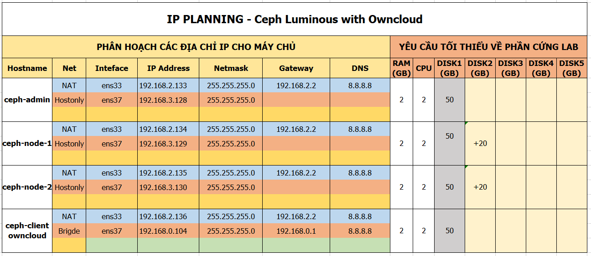

# Kết hợp Ceph Luminous với Owncloud thông qua Radosgw, S3 interface
---
## Chuẩn bị
### Sơ đồ

### Về tài nguyên

__Chuẩn bị 4 node, chạy CentOS 7 với cấu hình__

## Bắt đầu

### Phần 1: Triển khai Ceph và Nextcloud
> __Quan trọng__, phải lưu ý, thực hiện chính xác

__Cài đặt Ceph__

[Cài đặt Ceph Luminous trên 3 Node](../Ceph/ceph-install-luminous-lab.md)

__Cài đặt Owncloud__

[Cài đặt Owncloud 10 trên CentOS 7](../Nextcloud/oc-lab-install.md)

> Cú ý thiết lập IP theo lab hiện tại

### Phần 2: Thiết lập kết nối Owncloud với Ceph thông qua Radosgw, S3 interface
#### Bước 1: Thiết lập trên ceph-admin
> Thực hiện trên __ceph-admin__

Truy cập ceph-admin
```
ssh root@ceph-admin
```
Truy cập ceph cluster directory
```
cd cluster/
```
Tạo 2 rados gateway:
- 1 trên ceph-node-1
- 1 trên ceph-node-2

```
ceph-deploy rgw create ceph-node-1 ceph-node-2
```
> API gateways chạy trên port 7480.

> Sử dụng 2 gateway trong trường hợp cần tới HA, load balancing

Tạo user cho S3 interface, user được phép sử dụng service.
```
radosgw-admin user create --uid="ownclouds3" --display-name="Owncloud S3 User"
radosgw-admin quota set --quota-scope=user --uid="ownclouds3" --max-objects=-1 --max-size=20G
```
> User ở đây chính là Nextcloud server

Kiểm tra user __Ownclouds3__
```
[root@ceph-admin ~]# radosgw-admin user info --uid=Ownclouds3
{
    "user_id": "ownclouds3",
    "display_name": "Owncloud S3 User",
    "email": "",
    "suspended": 0,
    "max_buckets": 1000,
    "auid": 0,
    "subusers": [],
    "keys": [
        {
            "user": "ownclouds3",
            "access_key": "VJRQ3C2RHWJ1T91BSD5B",
            "secret_key": "APyIJpxRci3ETojXWz4fEIOiJMMMifYftFRK0JUM"
        }
    ],
    "swift_keys": [],
    "caps": [],
    "op_mask": "read, write, delete",
    "default_placement": "",
    "placement_tags": [],
    "bucket_quota": {
        "enabled": false,
        "max_size_kb": -1,
        "max_objects": -1
    },
    "user_quota": {
        "enabled": false,
        "max_size_kb": 20971520,
        "max_objects": -1
    },
    "temp_url_keys": []
}
```


#### Bước 2: Kiểm tra thiết lập radosgw sử dụng cho Owncloud server
> Thực hiện trên ceph-admin (có thể trên ceph-client)

Trước khi cầu hình Nextcloud sử dụng CEPH-S3, ta cần kiểm tra ceph-node-1 radosgw có cho phép sử dụng service

__Cài đặt gói__
```
yum -y install python-boto
```
Tạo python script "/root/cephs3test.py"
```
[root@ceph-admin ~]# vim cephs3test.py3

# content
import boto
import boto.s3.connection

access_key = 'VJRQ3C2RHWJ1T91BSD5B'
secret_key = 'APyIJpxRci3ETojXWz4fEIOiJMMMifYftFRK0JUM'
conn = boto.connect_s3(
   aws_access_key_id = access_key,
   aws_secret_access_key = secret_key,
   host = 'ceph-node-1', port = 7480,is_secure=False, calling_format = boto.s3.connection.OrdinaryCallingFormat(),)

bucket = conn.create_bucket('my-new-bucket')
for bucket in conn.get_all_buckets():
   print "{name} {created}".format(name = bucket.name,created = bucket.creation_date,)
```
Chạy script
```
python /root/cephs3test.py
```
Kết quả sẽ gần giống
```
my-new-bucket 2018-02-27T04:56:33.729Z
nextcloud 2018-02-27T04:48:46.508Z
```

Kiểm tra bằng node ceph-admin
```
[root@ceph-admin ~]# radosgw-admin bucket list
[
    "my-new-bucket",  
]
```
Xóa bucket test
```
radosgw-admin bucket rm my-new-bucket
```
#### Bước 3: Thiết lập trên ceph-client (Owncloud node)
__Kiểm tra thông tin user s3 vừa tạo__
```
# radosgw-admin user info --uid=ownclouds3
{
    "user_id": "ownclouds3",
    "display_name": "Owncloud S3 User",
    "email": "",
    "suspended": 0,
    "max_buckets": 1000,
    "auid": 0,
    "subusers": [],
    "keys": [
        {
            "user": "ownclouds3",
            "access_key": "VJRQ3C2RHWJ1T91BSD5B",
            "secret_key": "APyIJpxRci3ETojXWz4fEIOiJMMMifYftFRK0JUM"
        }
    ],
    "swift_keys": [],
    "caps": [],
    "op_mask": "read, write, delete",
    "default_placement": "",
    "placement_tags": [],
    "bucket_quota": {
        "enabled": false,
        "max_size_kb": -1,
        "max_objects": -1
    },
    "user_quota": {
        "enabled": false,
        "max_size_kb": 20971520,
        "max_objects": -1
    },
    "temp_url_keys": []
}
```
> Chú ý: Sử dụng các key sau

> Access key: VJRQ3C2RHWJ1T91BSD5B

> Secret key: APyIJpxRci3ETojXWz4fEIOiJMMMifYftFRK0JUM

__Cấu hình tích hợp Ceph-S3 với Owncloud__


## Mở rộng

__Kết nối Luminous với Nextcloud 13__

> Có thể thực hiện tương tự với Nextcloud nhưng phải tạo trước Bucket (Lỗi Nextcloud 13 không thể tạo mới bucket trên Ceph Luminous 3-3-2018)

### Cách tạo mới bucket

__Cài đặt gói__
```
yum -y install python-boto
```
Tạo python script "/root/cephs3bucket.py"
```
[root@ceph-admin ~]# vim cephs3bucket.py

# content
import boto
import boto.s3.connection

access_key = 'VJRQ3C2RHWJ1T91BSD5B'
secret_key = 'APyIJpxRci3ETojXWz4fEIOiJMMMifYftFRK0JUM'
conn = boto.connect_s3(
   aws_access_key_id = access_key,
   aws_secret_access_key = secret_key,
   host = 'ceph-node-1', port = 7480,is_secure=False, calling_format = boto.s3.connection.OrdinaryCallingFormat(),)

bucket = conn.create_bucket('my-new-bucket')
for bucket in conn.get_all_buckets():
   print "{name} {created}".format(name = bucket.name,created = bucket.creation_date,)
```
Chạy script
```
python /root/cephs3bucket.py
```
Kết quả sẽ gần giống
```
my-new-bucket 2018-02-27T04:56:33.729Z
```

Kiểm tra bằng node ceph-admin
```
[root@ceph-admin ~]# radosgw-admin bucket list
[
    "my-new-bucket",    
]
```
